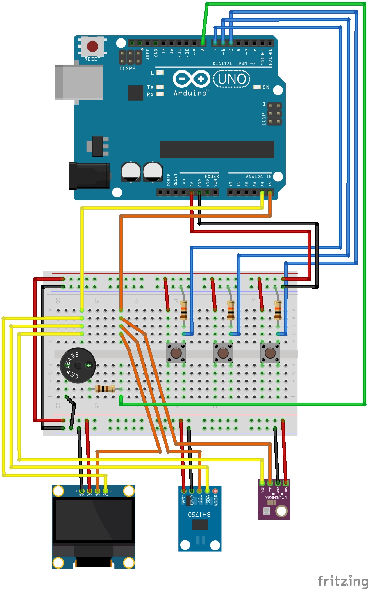

# Programmer Reminder

Programmer reminder is simple device developed on Arduino UNO board.

**Author:** Peter Mačinec

## Components

* Arduino UNO R3 (or compatible clone)
* BH1750 illuminance meter
* BME280 relative humidity, barometric pressure and ambient temperature sensor
* 1.3' OLED I2C display
* piezzo buzzer
* switch buttons (3x)
* resistors (3x 10k Ohm and 1x 100 Ohm)

## Breadboard schema

